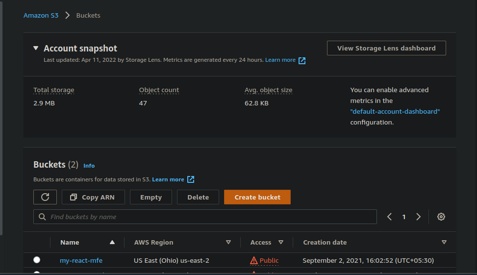
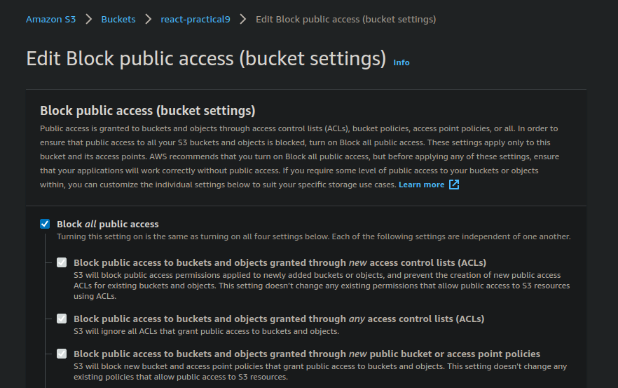
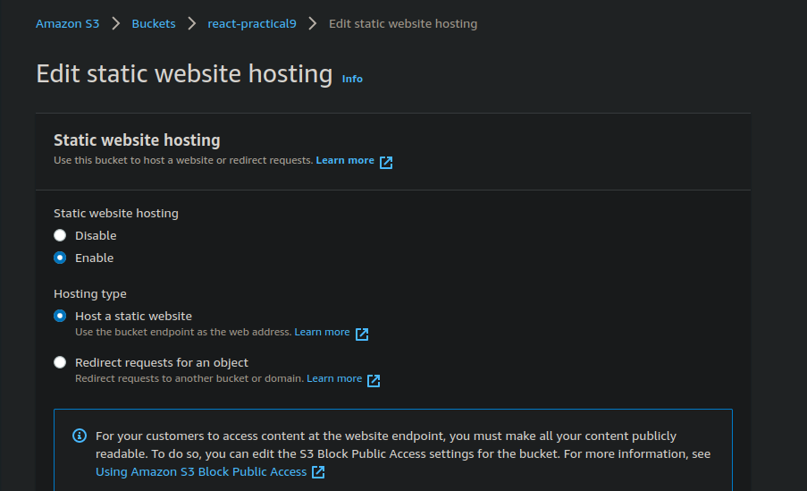
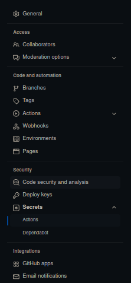
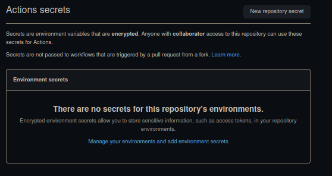
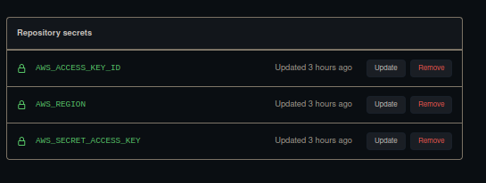
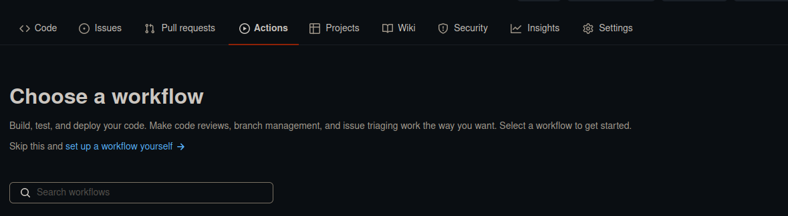
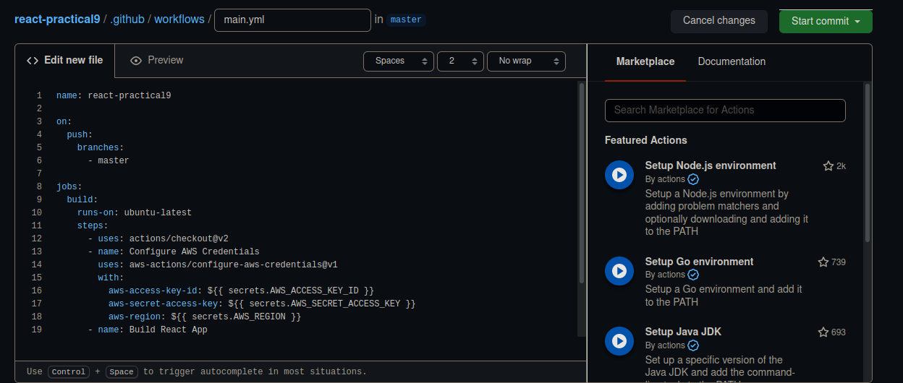

# react-practical-9

##### Hosted react-practical-8 on AWS with CI/CD integration with github workflow
##### here is the link: 
http://react-practical9.s3-website-us-west-2.amazonaws.com/

### Step by step guide

1. First of all create s3 bucket by clicking orange button 
 

2. Goto permission and  Untick Block all public access  
 

3. Goto property and Enable Static website hosting 
 
 that's All you have to do  for AWS part 

4.Now go to github repo setting->security->Secrets->Actions 
 
5. Create New repo secrets 
    
6. Add your AWS credentials 
    
7. Goto Actions tab 
 
8.Add your workflow accordingly and commit it. 
 
  That's it! Now whenever you push any code to master branch github will generate the build folder and upload it to S3 bucket.