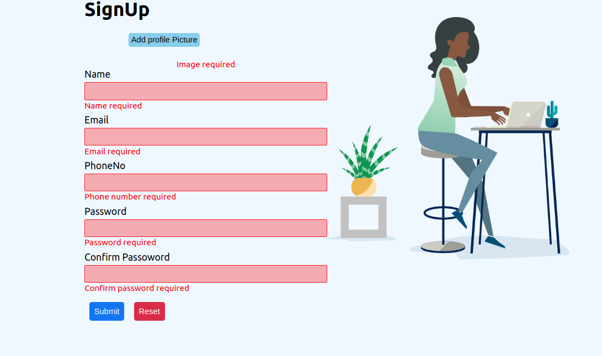
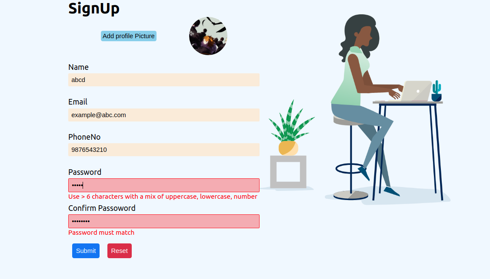
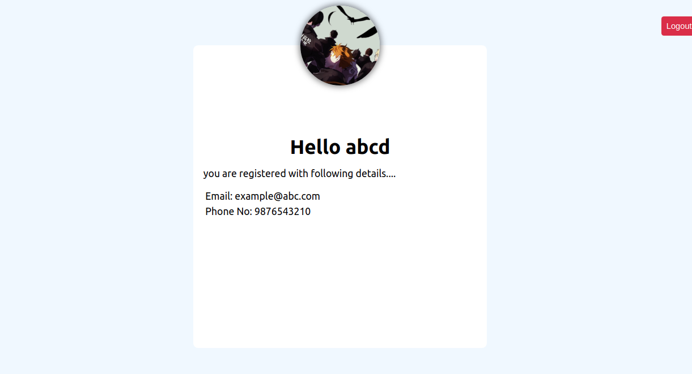

# react-practical-8

## user management app 
 used formik for forms and yup for validation and used react-router for routing purpose.
 ## 1 hosted on render: https://ramen.onrender.com  </br>
## Getting Started

1. Setup React

2. Clone the repo</br>

```sh
  git clone https://github.com/smeekas/react-practical8/
```

3. change directory</br>

```sh
  cd ./react-practical8
```

4. Install dependency</br>

```sh
  npm install
```

5. Run the app</br>

```sh
  npm start
```

6. Production build</br>

```sh
  npm run build
```

## App preview


